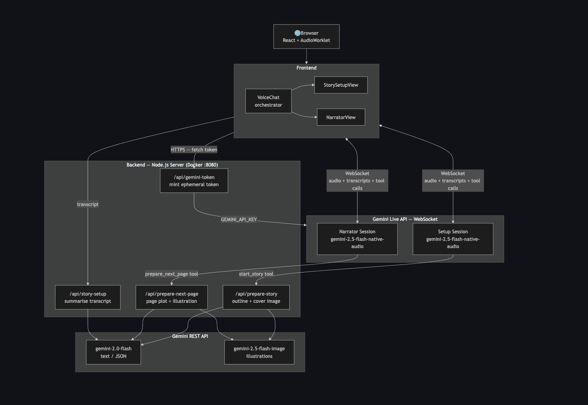

# Welcome to React Router!

A modern, production-ready template for building full-stack React applications using React Router.

[](https://stackblitz.com/github/remix-run/react-router-templates/tree/main/default)

## Features

- 🎙️ **Gemini Live Voice** – Real-time voice chat with the Gemini agent via the [Live API](https://ai.google.dev/gemini-api/docs/live-api/get-started-sdk)
- 🚀 Server-side rendering
- ⚡️ Hot Module Replacement (HMR)
- 📦 Asset bundling and optimization
- 🔄 Data loading and mutations
- 🔒 TypeScript by default
- 🎉 TailwindCSS for styling
- 📖 [React Router docs](https://reactrouter.com/)

## Architecture



## Getting Started

### Installation

Install the dependencies:

```bash
npm install
```

### Development

Start the development server with HMR:

```bash
npm run dev
```

Your application will be available at `http://localhost:5173`.

### Gemini Live Voice Chat

1. Get a Gemini API key from [Google AI Studio](https://aistudio.google.com/apikey).
2. Copy `.env.example` to `.env` and set `GEMINI_API_KEY`. The key stays on the server; the app uses ephemeral tokens for the Live API and never sends the key to the client.
3. Make sure `GEMINI_API_KEY` is set in your environment (for example via `.env`) when running or testing the app.
4. Run `npm run dev`, open the app, and click **Start story setup**.
5. Allow microphone access when prompted. Talk to the agent to set up your story; use **Mute** to stop sending your mic without ending the call.

## Building for Production

Create a production build:

```bash
npm run build
```

## Deployment

### Docker Deployment

To build and run using Docker:

```bash
docker build -t my-app .

# Run the container
docker run -p 3000:3000 my-app
```

The containerized application can be deployed to any platform that supports Docker, including:

- AWS ECS
- Google Cloud Run
- Azure Container Apps
- Digital Ocean App Platform
- Fly.io
- Railway

### DIY Deployment

If you're familiar with deploying Node applications, the built-in app server is production-ready.

Make sure to deploy the output of `npm run build`

```
├── package.json
├── package-lock.json (or pnpm-lock.yaml, or bun.lockb)
├── build/
│   ├── client/    # Static assets
│   └── server/    # Server-side code
```

## Styling

This template comes with [Tailwind CSS](https://tailwindcss.com/) already configured for a simple default starting experience. You can use whatever CSS framework you prefer.

---

Built with ❤️ using React Router.
